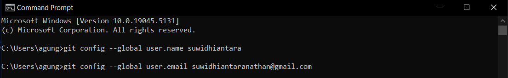

[](https://classroom.github.com/a/tbEHDGEc)
# Git and Github Introduction

| Nama  | Division        | Sub-Division  |
| ----- | ---------- | ---------- |
| I Gusti Agung Nathan Suwidhiantara   | PGR | Vision and Control |

## Early Procedure
### 1. Install Git on your PC/Laptop
   ``` 
    https://git-scm.com/downloads
   ```

  

### 2. Create a GitHub Account  
```
     https://github.com/join
```
  
### 3. Configure Git Bash or Terminal 
 ```
   git config --global user.name "Your GitHub username"
   git config --global user.email "youremail@example.com"
 ```
### 4. Generate SSH Keys
#### a. Open Git Bash
#### b. Generate your SSH key 
```
ssh-keygen -t ed25519 -C "your_email@example.com"
```

#### c. Press enter twice
#### d. Copy SSH key: 
```
clip < ~/.ssh/id_ed25519.pub
```
#### or
```
cd ~/.ssh
cat id_ed25519.pub
```
#### e. Go to GitHub Settings -> SSH and GPG keys -> New SSH Key
#### f. Paste the copied SSH key

## Create Repository
### 1. Go to Github 
```
https://github.com/new
```

### 2. Enter Repository Name
### 3. Choose Repository Type (public/private)
### 4. Click "Create Repository"
### 5. Copy Repository SSH Link
### 6. Connect the Repository to a Local Folder
#### a. Local Folder
   #####  i. Create a folder with an identical name to the repository 
   ##### ii. Open Git Bash or terminal 
   ```
   git init
   git remote add origin [SSH_Link]
   git branch -M main
   git pull origin "Branch_Name"
   ```

#### b. Git Clone 
  ##### i. Navigate to directory in File Explorer
  ##### ii. Open Git Bash or terminal 
   ```
   git clone [SSH_Link]
   cd ./"Repository_Name"
   git branch -M main
   ```

## Push File from Local to Github
### 1. Modify Local Files
### 2. Open Git Bash or Terminal 
  ```
  git add .
  git commit -m "Descriptive commit message"
  git push origin main
  ```

## Create New Branch in Github 
### 1. Open Git Bash in Repository Folder
### 2. Create and Switch to New Branch 
```
git checkout -B [new_branch_name]
```
### 3. Switch Between Branches 
``` 
git checkout [branch_name]
```

## Delete Branch in Github
### 1. Switch to another branch 
``` 
git checkout [target_branch]
```
### 2. Delete branch 
```
git branch -d [branch_to_delete]
```

## Merging Branch in Github
### 1. Switch to target branch 
```
git checkout [main_branch]
```
### 2. Merge another branch 
``` 
git merge [branch_to_merge]
```

## Other Procedure
### 1. Check Repository Status
``` 
git status
```
### 2. View Commit History 
```
git log 
git log --oneline
git log -n [number_of_commits]
```
### 3. List of Branches 
```
git branch 
```
### 4 .Git Documentation 
```
https://git-scm.com/docs 
```
 
